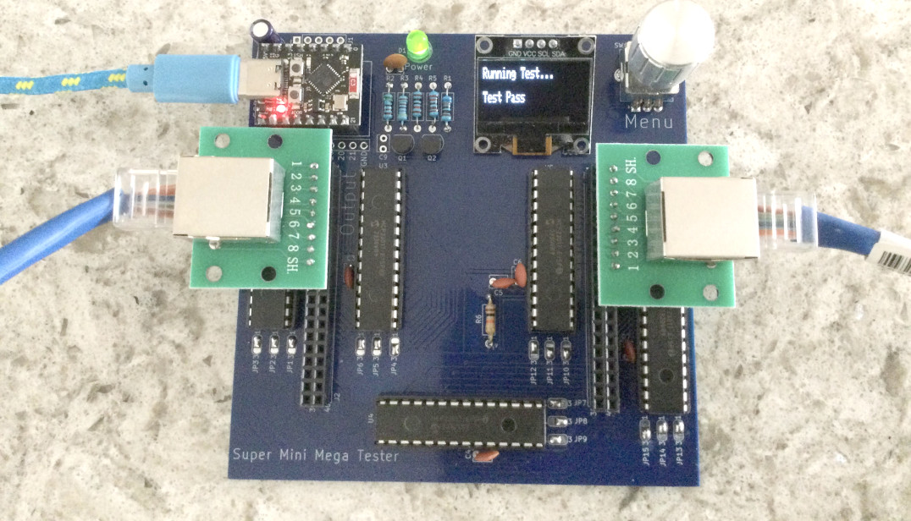

# Super_Mini_Mega_Tester
    
40 Pin Cable Tester platform using ESP32-C3 Super Mini module  
JP1 through JP15 jumpers must have solder jumpers blobbed on to set the addresses of the five GPIO expander ICs.
